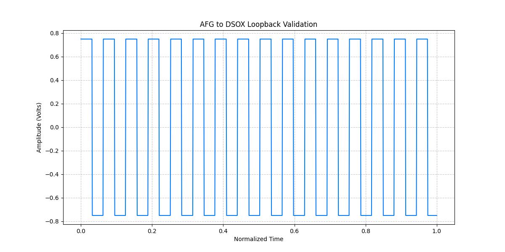

# Experiment: AFG to DSOX Loopback Validation (Plug-and-Play)

This document summarizes the end-to-end validation of the integrated signal chain between the **Tektronix AFG3022C** (Signal Source) and the **Keysight DSOX2002A** (Capture). This specific experiment focused on **Zero-Config Discovery (AUTO Mode)**.

## Hardware Setup
- **Source**: Tektronix AFG3022C connected via LAN.
- **Capture**: Keysight DSOX2002A connected via USB.
- **Interconnect**: BNC Output 1 (AFG) → BNC Input 1 (DSOX).

## Essential Device Configuration
For the automated discovery to succeed on macOS, the following physical settings were required:

### Keysight DSOX2002A (USB Discovery)
> [!IMPORTANT]
> **Enable Compatibility Mode**: By default, the DSOX may not appear as a standard USB-TMC device. 
> 1. Press the **[Utility]** key on the front panel.
> 2. Select **I/O** → **USB**.
> 3. Ensure the mode is set to **USB-TMC** (or "Compatibility Mode" depending on firmware version).
> 4. Once enabled, the device will appear as `USB0::0x0957::0x179B::...::INSTR`.

### Tektronix AFG3022C (LAN Discovery)
- **Static IP**: Assigned `169.254.105.101` for direct peer-to-peer connection.
- **VXI-11**: Ensure the VXI-11 server is enabled in the network settings.

## The "AUTO" Discovery Process
We validated the HAL's ability to find these instruments without any hardcoded addresses.

### How it works (Step-by-Step):
1. **USB Scan**: The HAL calls `pyvisa.ResourceManager().list_resources()` to find the DSOX on the USB bus.
2. **Smart LAN Probe**: If an instrument (like the AFG) isn't on USB, the HAL performs a **Smart ARP Scan** of the local subnet (`169.254.x.x`).
3. **Identity Verification**: The HAL connects to every found address and queries `*IDN?`.
4. **Type-Aware Routing**: Even if the scan finds multiple Keysight or Tektronix devices, it only returns a match that fits the requested category (e.g., ignoring a Scope when a Signal Generator is requested).

## Validation Script
The final validation used **zero** hardcoded addresses:

```python
from instrumation.factory import get_instrument

# 1. The HAL 'hunts' for the Signal Generator and Scope
afg = get_instrument("AUTO", "SG") 
dso = get_instrument("AUTO", "SCOPE")

print(f"AFG Found at: {afg.resource}")
print(f"DSO Found at: {dso.resource}")

# 2. Standard Loopback Procedure
afg.preset()
afg.set_waveform("SQU")
afg.set_frequency(100e3)
afg.set_voltage(1.5)
afg.set_output(True)

dso.auto_scale()
trace = dso.get_waveform(1)

# 4. Data Analysis & Visualization
import numpy as np
import matplotlib.pyplot as plt

y_data = np.array(trace.value)
x_data = np.linspace(0, 1, len(y_data)) 

plt.figure(figsize=(12, 6))
plt.plot(x_data, y_data, color='#007AFF', label='CH1 (AFG Output)')
plt.title("AFG to DSOX Loopback Validation")
plt.xlabel("Normalized Time")
plt.ylabel("Amplitude (Volts)")
plt.grid(True, linestyle='--', alpha=0.7)
plt.savefig("../assets/afg_dso_loopback.png")
plt.show()

# 5. Cleanup
afg.set_output(False)
```

## Results
The experiment successfully verified that **AUTO** mode is robust for both high-speed USB-TMC and network-based VXI-11 protocols.

### Visual Validation


## Conclusion
The `instrumation` HAL now supports true plug-and-play operation for the entire RF test bench. By combining ARP probing with USB scanning, the system eliminates the need for manual IP configuration in test scripts.
