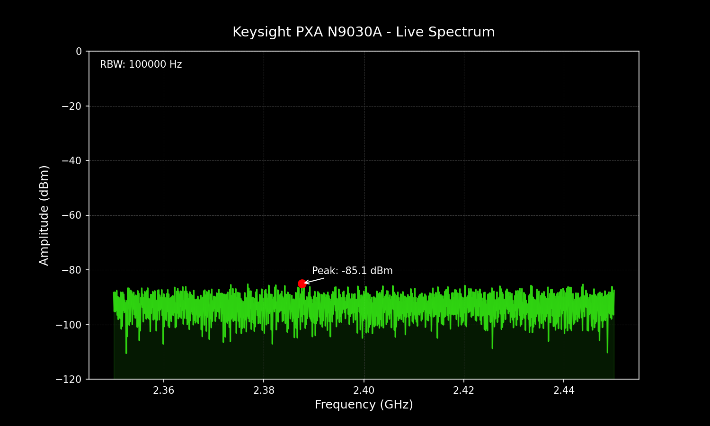

# Experiment: Keysight PXA N9030A Validation

This document summarizes the validation of the Keysight PXA N9030A Spectrum Analyzer integration into the `instrumation` HAL.

## Setup & Discovery
The PXA was connected via LAN on a local APIPA network (`169.254.x.x`). 

### Discovery Process
Standard VISA discovery (VXI-11) did not immediately find the instrument. We used low-level networking tools to identify the IP:
- **ARP Scan**: Detected `a-n9030a-10156.local` at `169.254.243.110`.
- **Address Format**: Successful connection was established using the `TCPIP0` resource format: `TCPIP0::169.254.243.110::inst0::INSTR`.

## Validation Script
The following script was used to exercise the Spectrum Analyzer suite. It leverages the `RecordingWrapper` to capture the SCPI traffic for future replay.

```python
from instrumation.factory import get_instrument
from instrumation.drivers.replay import RecordingWrapper, GoldenMaster

def run_pxa_validation():
    address = "TCPIP0::169.254.243.110::inst0::INSTR"
    with get_instrument(address, "SA") as sa:
        gm = GoldenMaster("pxa_session.json")
        sa = RecordingWrapper(sa, gm)
        
        sa.preset()
        sa.set_center_freq(2.4e9)
        sa.set_span(100e6)
        sa.peak_search()
        trace = sa.get_trace_data()
        sa.check_errors()
        gm.save()
```

## Results
The instrument successfully executed all commands. High-speed binary trace data was captured with 1001 points.

### Live Spectrum Capture
We generated a high-fidelity visualization of the noise floor to confirm the instrument's state.



### Recording Snippet (`pxa_session.json`)
The session was recorded as a "Golden Master" for regression testing.
```json
[
  {
    "cmd": "*IDN?",
    "res": "Agilent Technologies,N9030A,US53310156,A.14.04",
    "ts": 1714711375.0
  },
  {
    "cmd": ":SENS:FREQ:CENT 2400000000.0",
    "res": "",
    "ts": 1714711376.0
  }
]
```

## Step-by-Step Summary
1. **Physical Connection**: Connect PXA via LAN cable to Mac.
2. **IP Discovery**: Use `arp -a` to find the instrument's IP on `en2`.
3. **Driver Registration**: Registered `KeysightPXA` inheriting from `KeysightMXA`.
4. **Binary Fix**: Implemented `:FORM:BORD SWAP` to handle Little-Endian data on X-Series instruments.
5. **Validation**: Ran the test suite and verified data with Matplotlib.
