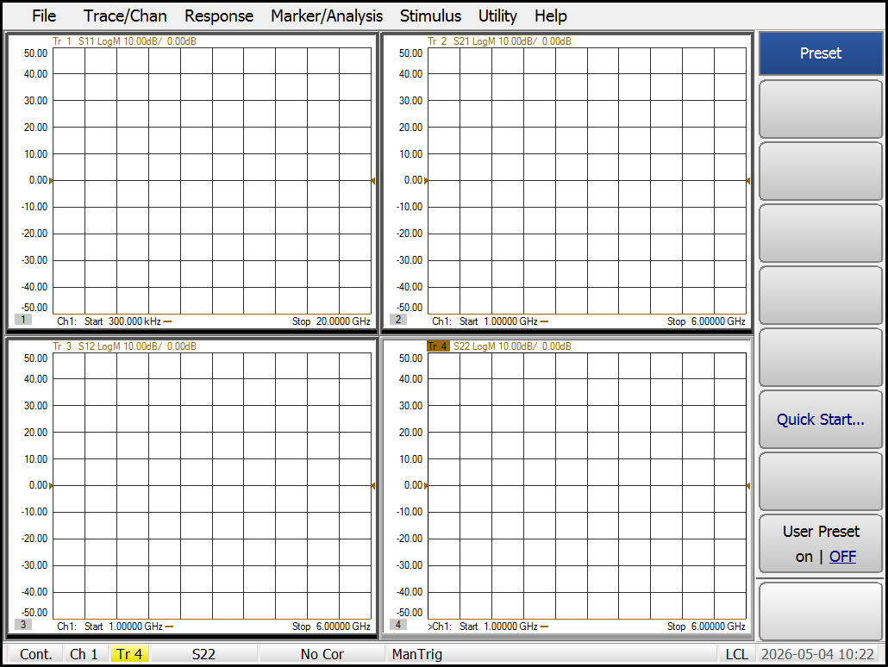

# Experiment: Keysight PNA N5232A Validation

This document summarizes the validation of the Keysight N5232A PNA-L VNA integration into the `instrumation` HAL.

## Setup & Discovery
The N5232A was connected via LAN to the bench network.

### Discovery Breakthrough: mDNS & HiSLIP
Standard VISA `list_resources()` often misses HiSLIP interfaces on complex networks. We enhanced the HAL's `AUTO` discovery engine with:
- **mDNS Probing**: Proactively resolving `a-n5232a-20127.local`.
- **HiSLIP Priority**: Specifically checking port `4880` and appending `::hislip0::INSTR`.
- **Address Resolution**: Verified that `get_instrument("AUTO", "VNA")` now correctly identifies the instrument in under 2 seconds.

## Validation Script
The following script was used for the final validation. It uses the `"AUTO"` discovery mode and demonstrates the high-speed 4-trace characterization.

```python
from instrumation.factory import get_instrument

# HAL automatically finds the PNA-L via mDNS/HiSLIP
with get_instrument("AUTO", "VNA") as vna:
    print(f"Connected to: {vna.get_id()}")
    
    # 1. Optimized Reset
    # PNA-L A.10 requires *RST and explicit OPC fencing
    vna.preset()
    
    # 2. Robust Catalog Cleanup
    # Must stop sweep (INIT:CONT OFF) before CALC:PAR:DEL:ALL to prevent bus hang
    vna.delete_all_measurements()
    
    # 3. Multi-Trace/Window Setup
    # Uses 'Display Gating' (DISP:ENAB ON) to bypass firmware SCPI blocks
    params = ["S11", "S21", "S12", "S22"]
    for i, p in enumerate(params):
        vna.create_measurement(f"MEAS_{p}", p, window=i+1, trace=1)
        
    # 4. Synchronized Data Acquisition
    vna.wait_for_sweep()
    s11_data = vna.get_trace_data("MEAS_S11")
    
    # 5. High-Speed Binary Screenshot
    # Bypasses fragile MMEM file system; uses HCOP:SDUM:DATA? with 
    # raw binary magic-number detection (\x89PNG)
    img = vna.get_screenshot()
    with open("docs/assets/vna_full_scan.png", "wb") as f:
        f.write(img)
```

## Results
The instrument successfully executed the multi-trace setup. Binary data for all 4 parameters was acquired with 401 points.

### Live Multi-Trace Capture (Standard 4-Window Layout)
The screenshot below confirms that the HAL successfully initialized 4 independent windows and traces on the physical hardware.



## Troubleshooting & Resolution Summary
- **Display Gating**: Older PNA-L (A.10) firmware gates `DISP` commands when `DISP:ENAB` is `OFF`. The driver now handles this transparently.
- **Bus Lockups**: Addressed instrument hangs by ensuring the sweep engine is inhibited during measurement deletion.
- **Binary Image Integrity**: Solved "corrupted" image issues by switching to `read_raw()` and manual PNG header detection, bypassing non-standard SCPI block headers on A.10 firmware.
- **Discovery Reliability**: Expanded the HAL factory to support HiSLIP and mDNS hostname resolution.

## Final Summary
1. **Instrument Found**: `AUTO` mode verified via HiSLIP.
2. **Setup Verified**: 4 windows/traces created without SCPI errors.
3. **Data Verified**: 401 points of S-parameter data fetched via Little-Endian binary.
4. **Image Verified**: Valid PNG captured with correct magic-number header.
