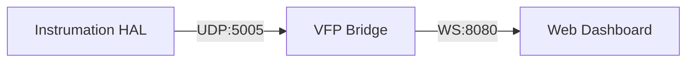

# Virtual Front Panel (VFP)

The Virtual Front Panel is a real-time web-based dashboard that allows you to visualize instrument states and measurement traces without physical access to the lab.

## Architecture

The VFP system consists of three components:
1.  **DataBroadcaster**: A Python utility in the HAL that streams JSON packets over UDP.
2.  **VFP Bridge**: A lightweight service that relays UDP packets to WebSockets.
3.  **VFP Dashboard**: A modern React application that visualizes the data.



## How to use the VFP

### 1. Start the Bridge
Run the bridge service to start listening for instrument data:
```bash
python -m instrumation.vfp_bridge
```

### 2. Stream Data from your Code
Use the `DataBroadcaster` (or let the drivers handle it automatically in future versions):

```python
from instrumation.utils import DataBroadcaster
from instrumation.results import MeasurementResult

with DataBroadcaster() as b:
    res = MeasurementResult(value=3.3, unit="V")
    b.send(res.to_dict())
```

### 3. Open the Dashboard
The dashboard is located in the `vfp-dashboard` directory. To run it locally:
```bash
cd vfp-dashboard
npm install
npm run dev
```
Then open [http://localhost:5173](http://localhost:5173) in your browser.

## Features
- **Real-time Traces**: Live plotting of measurement values.
- **Status Indicators**: Instant feedback on instrument health.
- **Multi-Channel Support**: View data from different channels or pods simultaneously.
- **Zero Impact**: UDP broadcasting is non-blocking and does not slow down your test execution.
