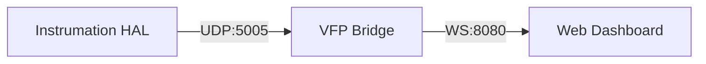

# Virtual Front Panel (VFP)

The Virtual Front Panel is a real-time web-based dashboard that allows you to visualize instrument states and measurement traces without physical access to the lab.

## Architecture

The VFP system consists of three components:
1.  **DataBroadcaster**: A Python utility in the HAL that streams JSON packets over UDP.
2.  **VFP Bridge**: A lightweight service that relays UDP packets to WebSockets.
3.  **VFP Dashboard**: A modern React application that visualizes the data.


```mermaid
graph LR
    HAL[Instrumation HAL] -- UDP:5005 --> Bridge[VFP Bridge]
    Bridge -- WS:8080 --> Dashboard[Web Dashboard]
```

## How to use the VFP

### Option A: One-call launcher (recommended)

`launch_dashboard()` starts the UDP bridge, the WebSocket relay, and an HTTP
server (serving the built React app plus a small REST API) in one call:

```python
from instrumation.dashboard import launch_dashboard

handle = launch_dashboard()  # http=8080, ws=8765, udp=9999
# ... run your test session, streaming via DataBroadcaster ...
handle.stop()
```

Or from the command line:

```bash
instrumation dashboard --port 8080 --ws-port 8765 --udp-port 9999
```

This requires the dashboard to be built first (`cd vfp-dashboard && npm run build`);
otherwise the HTTP server serves a placeholder page telling you to build it.

### Option B: Run components by hand (development)

Run the bridge service to start listening for instrument data:
```bash
python -m instrumation.vfp_bridge
```

### 2. Stream Data from your Code
Use the `DataBroadcaster` (or let the drivers handle it automatically in future versions).
Include `instrument_id` (and optionally `driver`) in `metadata` so the
dashboard can tell multiple instruments apart and render one card per
instrument instead of overwriting a single "last message" view:

```python
from instrumation.utils import DataBroadcaster
from instrumation.results import MeasurementResult

with DataBroadcaster() as b:
    res = MeasurementResult(
        value=3.3,
        unit="V",
        metadata={"instrument_id": "DMM1@TCPIP::10.0.0.6::INSTR", "driver": "Keysight34461A"},
    )
    b.send(res.to_dict())
```

See `examples/common/vfp_telemetry_stream.py` for a runnable multi-instrument
example.

### 3. Open the Dashboard
The dashboard is located in the `vfp-dashboard` directory. To run it locally:
```bash
cd vfp-dashboard
npm install
npm run dev
```
Then open [http://localhost:5173](http://localhost:5173) in your browser.

## Features
- **Real-time Traces**: Live plotting of measurement values.
- **Status Indicators**: Instant feedback on instrument health (connected, warning, error, offline).
- **Multi-Instrument Grid**: One card per `instrument_id`, auto-discovered from the stream -- no hardcoded instrument list.
- **Multi-Channel Support**: View data from different channels or pods simultaneously.
- **Zero Impact**: UDP broadcasting is non-blocking and does not slow down your test execution.
- **Data Export**: The "Export" button on the toolbar downloads the latest reading
  from every instrument as CSV or JSON, via `GET /api/readings` (add
  `?format=csv` for CSV). Backed by `launch_dashboard()`'s REST API.
